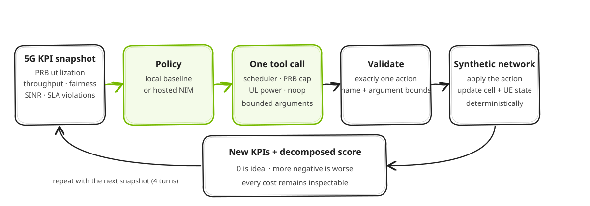

<!--
SPDX-FileCopyrightText: Copyright (c) 2026 NVIDIA CORPORATION & AFFILIATES. All rights reserved.
SPDX-License-Identifier: Apache-2.0
-->

# 5G Network Operator Agent with NVIDIA NIM

This self-contained notebook shows an agent-style observe, act, validate, and score loop over a deterministic synthetic single-cell model. Local baselines work without credentials; a hosted NVIDIA NIM policy is optional.

The example is educational. It is not a network controller, does not train a policy, use recorded playback, connect to a live RAN, or claim physical-network fidelity. Its fixed synthetic result is not evidence of model quality or network performance.

## What it demonstrates

- Inspect initial cell and UE KPIs from a fixed synthetic scenario.
- Choose exactly one of four bounded actions on each of four turns.
- Validate every action before applying it.
- Inspect a complete before/action/after transition and decomposed score.
- Compare noop and scripted-relief baselines on the identical scenario and horizon.
- Optionally compare one OpenAI-compatible hosted NVIDIA NIM policy.

## Prerequisites

- Python 3.10 or newer.
- No GPU or credential for the local baselines.
- An existing NVIDIA API key only for the optional hosted section.

## Quick start

Run from the repository root:

```bash
python3 -m venv .venv
source .venv/bin/activate
python -m pip install -r community/5g-network-operator-agent/requirements.txt
jupyter lab community/5g-network-operator-agent/5g_network_operator_agent.ipynb
```

Run all cells from top to bottom. With no API key, the notebook completes every offline section and skips only hosted-policy evaluation.

## Optional hosted NVIDIA NIM

Copy the template, then set `NVIDIA_API_KEY` in the resulting `.env` file. `NVIDIA_MODEL` is an optional override.

```bash
cp community/5g-network-operator-agent/.env.example community/5g-network-operator-agent/.env
```

Leaving `NVIDIA_MODEL=` blank uses `nvidia/nemotron-3-super-120b-a12b`. The default endpoint is `https://integrate.api.nvidia.com/v1`. The adapter requests one tool call and records malformed output or request errors as rejected actions; it never silently substitutes `noop`. Never commit `.env`, API keys, or executed hosted outputs.

## Architecture

- `5g_network_operator_agent.ipynb`: offline-first walkthrough, hosted adapter, comparison, and transition inspection.
- `network_environment.py`: standard-library-only synthetic environment and policies.
- `tests/test_network_environment.py`: focused environment and episode tests.



## Bounded actions

| Action | Bounds |
| --- | --- |
| `set_scheduler_policy` | `PF`, `RR`, or `MAX_CI` |
| `set_prb_cap` | One observed UE; `max_prb_pct` from 10 to 100 |
| `set_ul_power_control` | `p0_dbm` from -100 to -70 and `alpha` from 0.4 to 1.0 |
| `noop` | No arguments and no control change |

## Scoring

Each after-state score is the exact sum of five non-positive costs; zero is ideal and more-negative is worse:

- `-0.45 × unmet_ratio`;
- `-0.20 × (1 - Jain fairness)` over UE satisfaction ratios;
- `-0.25 × SLA violations / UE count`;
- `-0.10 × max(0, (PRB utilization - 85) / 15)`; and
- `-0.25` for a rejected action, otherwise zero.

Only compare totals when the scenario and horizon are identical.

## Verification

Run the focused tests:

```bash
python -m pytest community/5g-network-operator-agent/tests -q
```

Execute an output copy offline, leaving the source notebook unchanged:

```bash
NVIDIA_API_KEY= jupyter nbconvert --to notebook --execute \
  --output /tmp/5g_network_operator_agent.executed.ipynb \
  community/5g-network-operator-agent/5g_network_operator_agent.ipynb \
  --ExecutePreprocessor.timeout=180
```

The explicit empty value is intentional: it takes precedence over a populated example-local `.env`, so this command cannot re-enable hosted evaluation.
